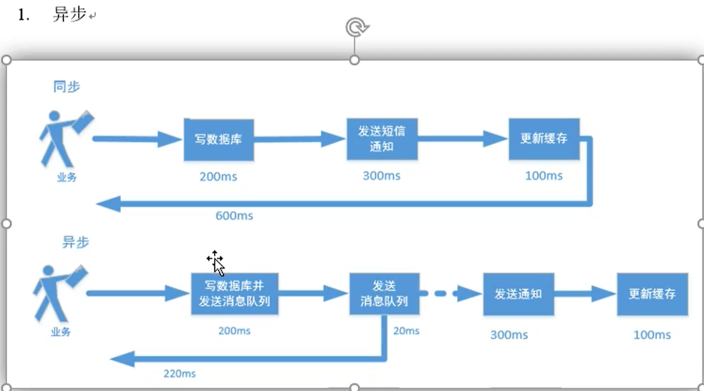
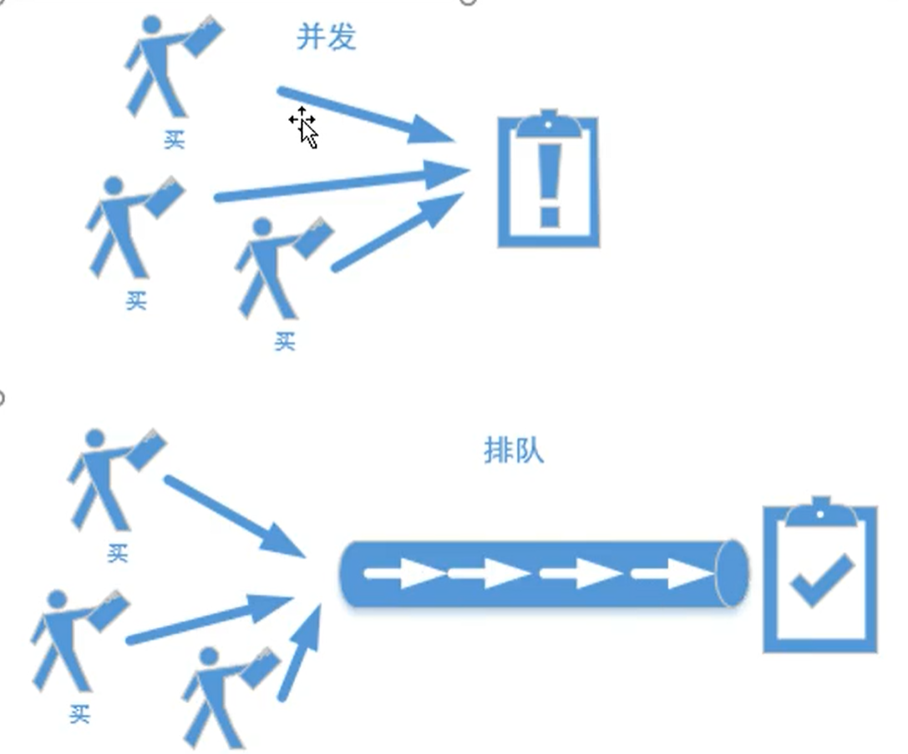
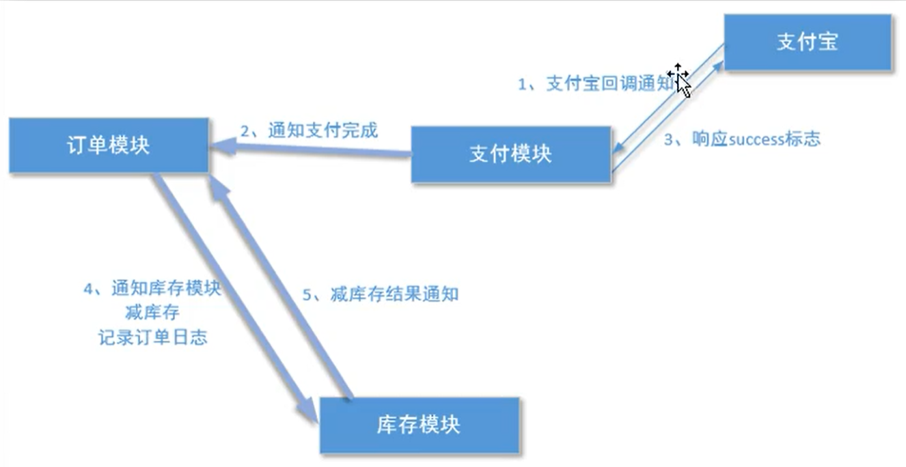

## 消息队列在项目中的使用

背景：在分布式系统中是如何处理高并发的。

​		由于在高并发的环境下，来不及同步处理用户发送的请求，则会导致请求发生阻塞。比如说，大量的insert，update之类的请求同时到达数据库Mysq，直接导致无数的行锁表锁，甚至会导致请求堆积很多。从而触发too many connections错误。使用消息队列可以解决

排队处理

消息队列在电商中的使用场景

消息队列的弊端：

​		消息不确定性：延迟队列，轮询技术来解决该问题即可

推荐使用activeMQ！环境是java。