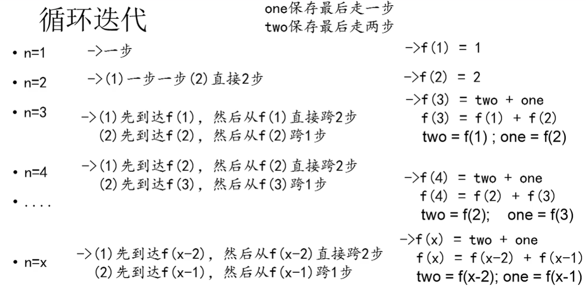

### 编程题：有n步台阶，一次只能上1步或2步，共有多少种走法？

### 1、递归


```java
public int f(int n){
    if(n<1){
        return 0;
    }
    if(n==1||n==2){
        return n;
    }
    return f(n-2)+f(n-1);
}
```

### 2、迭代



```java
public int loop(int n){
       if(n<1){
        return 0;
    }
    if(n==1||n==2){
        return n; 
    }
    int one=2;//初始化为走到第二级台阶的走法
    int two=1;//初始化为走到第一级台阶的走法
    int sum=0;
    //最后跨2步+最后跨1步的走法
    for(int i=3;i<=n;i++){
        sum = two + one;
        two=one;
        one=sum;
    }
    return sum;
}
```

### 小结

方法调用自身称为递归，利用变量的原值推出新值称为迭代。

递归：

​		优点：大问题转化为小问题，可以减少代码量，同时代码精简，可读性好；

​		缺点：递归调用浪费了空间，而且递归太深容易会造成堆栈的溢出。

迭代：

​		优点：代码运行效率好，因为时间只因循环次数增加而增加，而且没有额外的空间开销；

​		缺点：代码不如递归简洁，可读性好